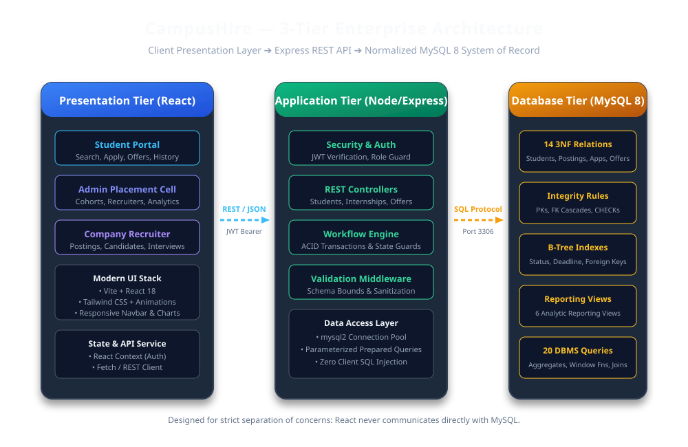
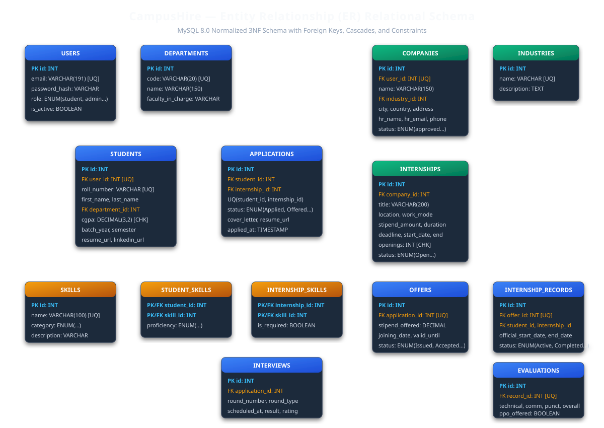

# CampusHire — Student Internship & Recruitment Management System

CampusHire is a DBMS-first internship lifecycle application for a university placement cell. Students discover and apply for roles; placement staff monitor the recruitment funnel with database-driven analytics.

## Highlights
- Student registration, JWT login, profile editing, role-aware navigation
- Searchable, filterable internship catalogue with deadlines and skill tags
- Transactional applications with duplicate/deadline protection
- Admin funnel dashboard and department analytics sourced from MySQL
- Normalized schema, junction tables, constraints, indexes, views, SQL reporting queries
- Docker Compose development environment

## Architecture
`React + Vite → Express REST API → parameterized MySQL 8 queries` (the browser never connects to MySQL).

  


## Repository
- `frontend/` React UI, routes and responsive styling
- `backend/src/server.js` Express routes, validation, JWT middleware, transactions, error handling
- `database/schema.sql` normalized DDL; `seed.sql` small demo seed; `views.sql` reporting views; `queries.sql` 20 DBMS queries
- `scripts/` reproducible synthetic-data and ETL staging scripts
- `docs/` schema, API and evaluation documentation

## Run with Docker (recommended)
```bash
docker compose up --build
# open http://localhost:5173
```
MySQL initialization scripts run only on the first creation of the volume. To reset: `docker compose down -v && docker compose up --build`.

## Run locally
1. Copy `.env.example` to `.env`, create a MySQL 8 database, then run `database/schema.sql`, `database/seed.sql`, and `database/views.sql`.
2. `npm run install:all`
3. `npm run dev` (API on 4000, UI on 5173).

Demo admin: `admin@campushire.edu` / `Admin@123`. Change this seed password for any deployed instance. New student accounts are created from Register.

## API overview
`POST /api/auth/register`, `POST /api/auth/login`, `GET /api/auth/me`, `GET /api/internships`, `GET /api/internships/:id`, `POST /api/internships/:id/apply`, `GET /api/applications`, `GET/PUT /api/students/me`, `GET /api/students/dashboard`, `PATCH /api/applications/:id/status`, `GET /api/analytics`, `GET /api/health`.

## Dataset methodology
The checked-in seed is deliberately small and reviewable for local startup. `scripts/generate_data.py` creates reproducible synthetic student staging rows using seed 601; generated activity must not be represented as real people or outcomes. `clean_data.py` cleans optional public CSV inputs in `data/raw/`. The system of record remains normalized MySQL, not CSV files. A larger benchmark can be generated by increasing the loop sizes.

## Security and integrity
Passwords are bcrypt-hashed, secrets are environment variables, SQL uses placeholders, and JWT role middleware protects resources. Unique `(student_id, internship_id)` prevents duplicate applications. Deadline/status validation is enforced in the service transaction; foreign keys and checks protect relationships. Never commit `.env`.

## Testing
- `npm test --prefix backend` runs the Node test suite (health contract and validation coverage in `backend/test/`).
- Verify with Docker: health endpoint, login, internship search, registration, duplicate application rejection, and admin analytics.

## Future enhancements
Interview/offer/record CRUD screens, object-storage resume uploads, pagination controls for large cohorts, and a background ETL scheduler can be added without changing the core normalized model.
